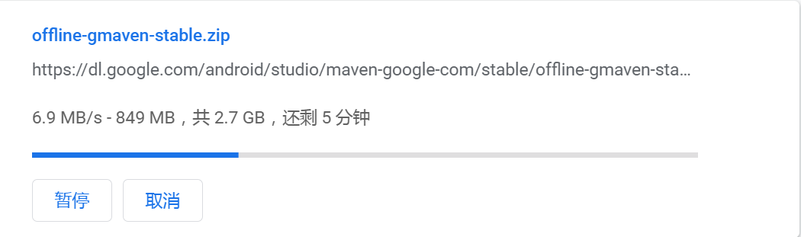
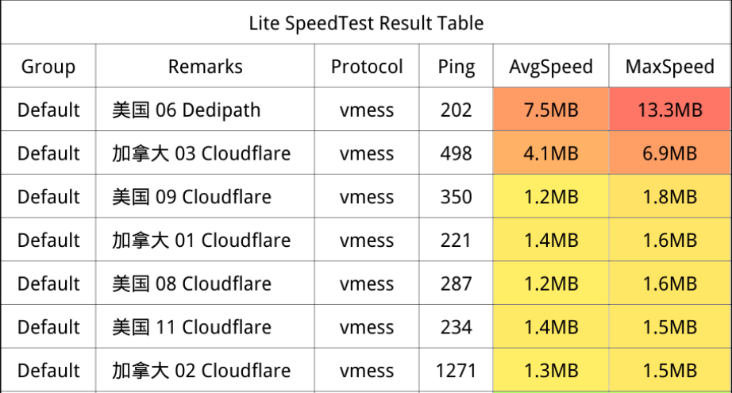

# ⏰ 自动获取订阅链接

- 自动合并 ss ssr trojan vmess vless 等免费节点链接。
- 用 Python 实现。

## ⚠️ 注意

- 欢迎免费使用本订阅,链接来自网络，仅作学习使用。
- 使用页面所提供的任意资源时。
- 请务必遵守当地法律。

## 🚀 每3小时更新一次

- v2ray 订阅，适用于 v2rayN, Qv2ray 等 (base64),Clash 订阅，适用于 Clash .NET 等。openclash.yaml支持udp：true参数。

```
混合节点(全部)：
https://dweb.link/ipns/k51qzi5uqu5dlfnig6lej7l7aes2d5oed6a4435s08ccftne1hq09ac1bulz2f/node.txt

混合节点(国内)：
https://dweb.link/ipns/k51qzi5uqu5dlfnig6lej7l7aes2d5oed6a4435s08ccftne1hq09ac1bulz2f/nodecn.txt

Clash节点：
https://dweb.link/ipns/k51qzi5uqu5dlfnig6lej7l7aes2d5oed6a4435s08ccftne1hq09ac1bulz2f/clash.yaml

OpenClash节点：
https://dweb.link/ipns/k51qzi5uqu5dlfnig6lej7l7aes2d5oed6a4435s08ccftne1hq09ac1bulz2f/openclash.yaml

Clash纯节点：
https://dweb.link/ipns/k51qzi5uqu5dlfnig6lej7l7aes2d5oed6a4435s08ccftne1hq09ac1bulz2f/clashnode.yaml
```

- 国外IPFS节点，不稳定，如果上面打不开，可以使用下面节点替换。
- http://121.36.203.35:8080/ipns/k51qzi5uqu5dlfnig6lej7l7aes2d5oed6a4435s08ccftne1hq09ac1bulz2f/
- http://121.46.250.130:8080/ipns/k51qzi5uqu5dlfnig6lej7l7aes2d5oed6a4435s08ccftne1hq09ac1bulz2f/
- http://122.9.166.5:8080/ipns/k51qzi5uqu5dlfnig6lej7l7aes2d5oed6a4435s08ccftne1hq09ac1bulz2f/
- http://122.9.132.178:8080/ipns/k51qzi5uqu5dlfnig6lej7l7aes2d5oed6a4435s08ccftne1hq09ac1bulz2f/
- http://118.123.241.59:8080/ipns/k51qzi5uqu5dlfnig6lej7l7aes2d5oed6a4435s08ccftne1hq09ac1bulz2f/
- http://15.237.96.141:8080/ipns/k51qzi5uqu5dlfnig6lej7l7aes2d5oed6a4435s08ccftne1hq09ac1bulz2f/
- https://dweb.link/ipns/k51qzi5uqu5dlfnig6lej7l7aes2d5oed6a4435s08ccftne1hq09ac1bulz2f/

## 📧 更新推送

- https://t.me/opmhth
- 
- 扫码加交流群

## ⭐ Speed




## ⭐ 特别感谢

- https://github.com/codingbox/Free-Node-Merge
- https://github.com/animalize/qqwry-python3